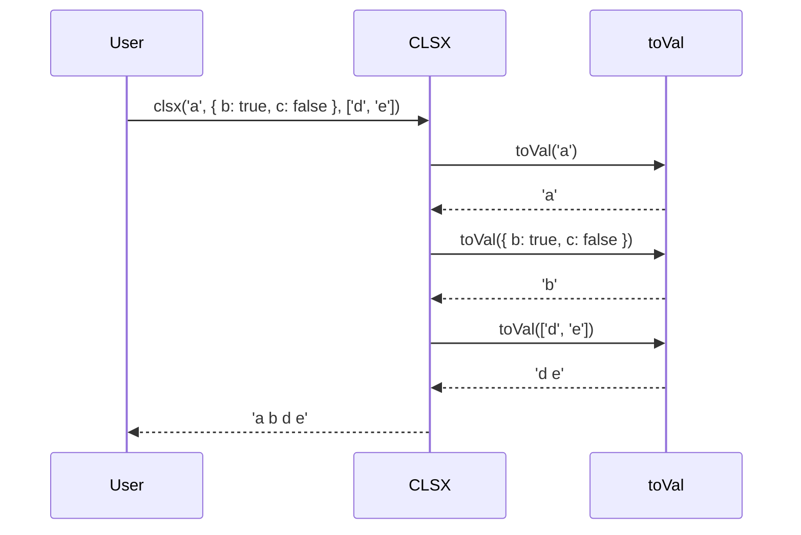

# Chapter 1: `clsx` function (main)

Welcome! This is the first chapter of our `clsx` tutorial. We're going to start with the heart of `clsx`: the `clsx` function itself.

Imagine you're building a website and you want to style a button. Sometimes you want the button to be blue, and other times you want it to be red, depending on whether it's active or not. You also always want it to have a default "button" style. How do you construct the `className` string for the button element?

That's where `clsx` comes in! It helps you build these `className` strings dynamically and cleanly.

## The Problem: Building `className` Strings

Manually building `className` strings can get messy very quickly. Consider this:

```javascript
let className = 'button'; // always has "button" class
let isActive = true;

if (isActive) {
  className += ' button--active';
}

console.log(className); // Output: "button button--active"
```

This simple example already has potential issues.  What if `isActive` is false?  You'd want just `"button"`. What if we also want to add another class, conditionally? It gets messy really fast!

`clsx` simplifies this process, making your code cleaner and easier to read.

## The `clsx` Solution

The `clsx` function takes any number of arguments, which can be strings, objects, or arrays. It then combines these into a single, space-separated string, ignoring anything that's "falsey" (like `false`, `null`, `undefined`, `0`, or an empty string).

Here's how we can rewrite the button example using `clsx`:

```javascript
import clsx from 'clsx';

let isActive = true;

let className = clsx('button', isActive && 'button--active');

console.log(className); // Output: "button button--active"
```

See how much cleaner that is? If `isActive` were `false`, `clsx` would simply return `"button"`.

## Key Concepts

Let's break down what `clsx` can handle:

1.  **Strings:** These are the most basic. `clsx('button', 'button--small')` becomes `"button button--small"`.

2.  **Objects:**  The keys of the object are class names, and the values are boolean. If the value is `true`, the class name is included. If `false`, it's excluded.

    ```javascript
    clsx({ button: true, 'button--disabled': false, 'button--primary': true })
    // Output: "button button--primary"
    ```

3.  **Arrays:** `clsx` can handle arrays of strings, objects, or even *nested* arrays! It flattens them and processes each element.

    ```javascript
    clsx(['button', ['button--large', { 'button--active': true }]])
    // Output: "button button--large button--active"
    ```

4.  **Falsey Values:** `clsx` automatically ignores `false`, `null`, `undefined`, `0`, and empty strings. This is super helpful for conditional class names!

    ```javascript
    let isLoading = false;
    clsx('button', isLoading && 'button--loading');
    // Output: "button" (because isLoading is false)
    ```

## Usage Examples

Let's see a few more examples to solidify your understanding.

**Example 1: Basic strings**

```javascript
import clsx from 'clsx';

const result = clsx('foo', 'bar', 'baz');
console.log(result); // Output: "foo bar baz"
```

`clsx` simply joins the strings together with spaces.

**Example 2: Using an object**

```javascript
import clsx from 'clsx';

const result = clsx({
  'foo': true,
  'bar': false,
  'baz': true
});
console.log(result); // Output: "foo baz"
```

Only the class names with `true` values are included.

**Example 3: Combining strings and objects**

```javascript
import clsx from 'clsx';

const isActive = true;
const result = clsx('button', { 'button--active': isActive });
console.log(result); // Output: "button button--active" (if isActive is true) or "button" (if isActive is false)
```

This is a very common use case for conditionally adding a class.

**Example 4: Using arrays**

```javascript
import clsx from 'clsx';

const classes = ['foo', 'bar'];
const result = clsx(classes, 'baz');
console.log(result); // Output: "foo bar baz"
```

`clsx` flattens the array and includes all the class names.

## Under the Hood

So, how does `clsx` actually *work*?  Let's walk through a simplified scenario.

Imagine we call `clsx('a', { b: true, c: false }, ['d', 'e'])`. Here's what happens conceptually:



Essentially:

1.  `clsx` iterates through each of its arguments.
2.  For each argument, it calls an internal function called [`toVal`](04__toval__function__internal__.md). The `toVal` function is responsible for converting each individual argument into a string of class names.
3.  `toVal` handles different data types such as strings, objects, and arrays.
4. `clsx` joins the results from `toVal` together with spaces, returning the final `className` string.

Here's a simplified look at the code (referencing `src/index.js`):

```javascript
// Simplified version of clsx
function toVal(mix) { // see [toVal Function (internal)](04__toval__function__internal__.md) for more details
	if (typeof mix === 'string') {
		return mix;
	} // other types are handled in the actual toVal function
}

function clsx() {
	let str = '';
	for (let i = 0; i < arguments.length; i++) {
		let tmp = arguments[i];
		if (tmp) { // ignores falsey values
			let x = toVal(tmp); // converts to string
			if (x) {
				str && (str += ' '); // add space if needed
				str += x;
			}
		}
	}
	return str;
}
```

This simplified version shows the core logic: iterate through the arguments, convert them to strings, and join them together. The real `clsx` implementation is a bit more complex to handle different data types efficiently, but this gives you the general idea.  We will dissect the [`toVal`](04__toval__function__internal__.md) function itself in more detail in its own chapter.

## Conclusion

The `clsx` function is a powerful tool for dynamically building `className` strings in your JavaScript projects. It handles different data types, ignores falsey values, and keeps your code clean and readable. This chapter covered the main use case of building `className` strings, the key concepts, usage examples, and a peek under the hood.

In the next chapter, we'll take a closer look at the [`ClassValue` type](02__classvalue__type_.md), which defines the types of arguments that `clsx` can accept.


---

Generated by [AI Codebase Knowledge Builder](https://github.com/The-Pocket/Tutorial-Codebase-Knowledge)