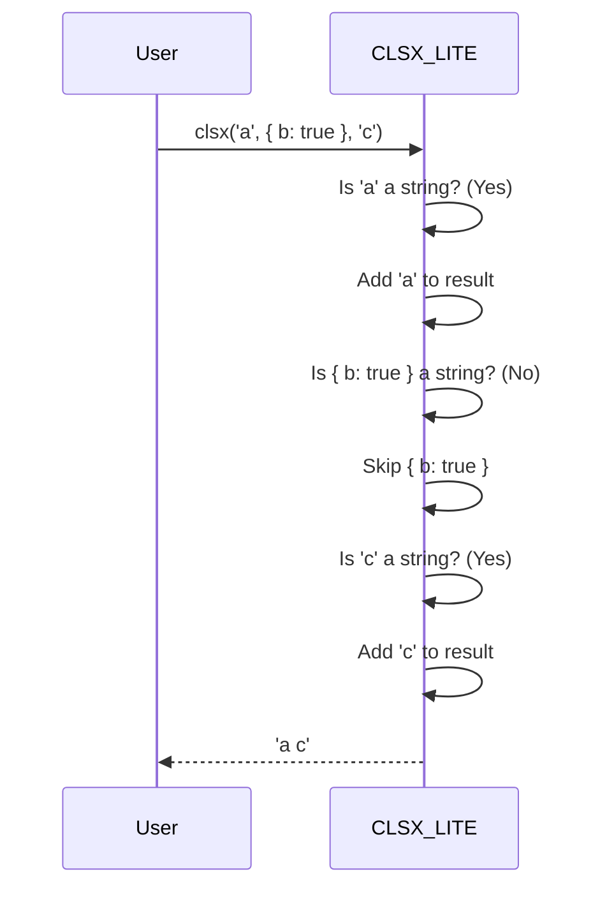

# Chapter 3: `clsx/lite` module

In the previous chapter, [`ClassValue` type](02__classvalue__type_.md), we explored the different types of inputs that `clsx` can handle. Now, let's meet its smaller, faster cousin: `clsx/lite`.

Imagine you're building a simple website with a button. You only need to add a few different styles to it based on whether it's active or not, and all your styles are simple strings. You don't need all the fancy features of the full `clsx` function, like objects or arrays. That's where `clsx/lite` shines!

`clsx/lite` is a lightweight version of `clsx` designed for scenarios where you *only* need to concatenate strings. It's faster and smaller, making it ideal for situations where performance is critical and your input types are limited.

## The Problem: `clsx` Is Overkill For Simple String Concatenation

Sometimes, using the full `clsx` function is like using a Swiss Army knife to open a letter. It works, but it's more tool than you need! If you're *only* dealing with strings, the full `clsx` function has extra overhead from handling other data types like objects and arrays.

## The `clsx/lite` Solution

`clsx/lite` is specifically designed to efficiently concatenate strings. It ignores any non-string inputs, making it faster and smaller than the full `clsx` function.

Here's how you can use it:

```javascript
import clsx from 'clsx/lite';

let className = clsx('button', 'button--primary', 'button--active');

console.log(className); // Output: "button button--primary button--active"
```

Simple, right?

## Key Concepts

The core concept of `clsx/lite` is its *simplicity*. It only does one thing, and it does it well:

1.  **String Inputs Only:** `clsx/lite` only accepts string inputs.
2.  **Ignores Non-Strings:** Any input that is *not* a string (like objects, arrays, numbers, booleans, `null`, or `undefined`) will be silently ignored. This means you won't get errors; `clsx/lite` will just skip them.
3.  **Concatenation:** It joins all the string inputs together with spaces, just like the full `clsx` function.

## Usage Examples

Let's see some examples to illustrate how `clsx/lite` works.

**Example 1: Basic Strings**

```javascript
import clsx from 'clsx/lite';

const result = clsx('foo', 'bar', 'baz');
console.log(result); // Output: "foo bar baz"
```

Just like the full `clsx`, `clsx/lite` simply joins the strings together with spaces.

**Example 2: Ignoring Non-String Inputs**

```javascript
import clsx from 'clsx/lite';

const result = clsx('foo', { bar: true }, ['baz'], 123, null, undefined, true);
console.log(result); // Output: "foo"
```

Notice that the object, array, number, `null`, `undefined`, and boolean are all ignored. Only the string `'foo'` is included in the output.

**Example 3: Conditional Classes with Strings**

```javascript
import clsx from 'clsx/lite';

const isActive = true;
const activeClass = isActive ? 'button--active' : '';
const result = clsx('button', activeClass);
console.log(result); // Output: "button button--active" (if isActive is true) or "button" (if isActive is false)
```

This example shows how you can use `clsx/lite` for conditional class names, but you need to handle the condition *outside* of `clsx/lite` itself.

## Under the Hood

Let's take a peek at how `clsx/lite` works internally.

When you call `clsx/lite` with some arguments, it iterates through each argument and checks if it's a string. If it is, it adds it to the final class name string. If it's not, it skips it.

Here's a simplified sequence diagram:



Here's the actual code from `src/lite.js`:

```javascript
export function clsx() {
	var i=0, tmp, str='', len=arguments.length;
	for (; i < len; i++) {
		if (tmp = arguments[i]) {
			if (typeof tmp === 'string') {
				str += (str && ' ') + tmp;
			}
		}
	}
	return str;
}
```

Let's break it down:

1.  `for (; i < len; i++)`: This loop iterates through each argument passed to `clsx/lite`.
2.  `if (tmp = arguments[i])`: This checks if the current argument `tmp` is truthy (not `null`, `undefined`, `0`, `''`, etc.). If it's falsey, it skips to the next argument.
3.  `if (typeof tmp === 'string')`: This is the key part! It checks if the argument is a string.
4.  `str += (str && ' ') + tmp;`: If the argument is a string, it adds it to the `str` variable, with a space in between if `str` already has something in it.

As you can see, `clsx/lite` is very straightforward. It only handles strings and ignores everything else.

## When to Use `clsx/lite`

Use `clsx/lite` when:

-   You only need to concatenate strings.
-   Performance is critical.
-   You want to minimize the bundle size of your application.

Avoid `clsx/lite` when:

-   You need to use objects or arrays to conditionally include class names.
-   You need the full flexibility of the `clsx` function.

## Conclusion

The `clsx/lite` module is a specialized tool for efficiently concatenating strings. It's faster and smaller than the full `clsx` function, but it only works with string inputs. If you're building a simple website or application where performance is critical and you only need to concatenate strings, `clsx/lite` is a great choice.

In the next chapter, we'll take a look at the [`toVal` function (internal)](04__toval__function__internal__.md), which is an internal function used by the full `clsx` function to convert different types of inputs into strings.


---

Generated by [AI Codebase Knowledge Builder](https://github.com/The-Pocket/Tutorial-Codebase-Knowledge)