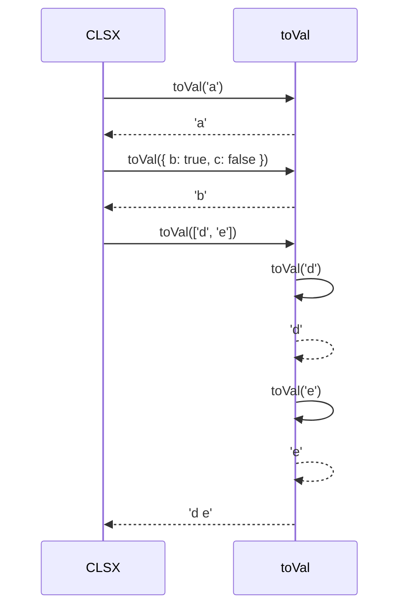

# Chapter 4: `toVal` function (internal)

In the previous chapter, [`clsx/lite` module](03__clsx_lite__module_.md), we explored a simplified version of `clsx` that only handles strings. Now, let's dive into the heart of the *full* `clsx` function and meet one of its key helpers: the `toVal` function.

Imagine `clsx` as a translator. It takes different "languages" (strings, objects, arrays) and converts them all into a single, understandable "language": a string of class names. The `toVal` function is like a specialized sub-translator that knows how to handle each individual "word" (each individual `ClassValue`). It is the powerhouse that converts these individual `ClassValue` elements (see [ClassValue` type](02__classvalue__type_.md)) into their string representation.

## The Problem: Handling Different Types

The main `clsx` function (see [`clsx` function (main)](01__clsx__function__main__.md)) accepts various types of arguments such as string, array, object, etc. How can `clsx` handle these various types? It needs a mechanism to unify them into strings.

That's where `toVal` comes in!

## The `toVal` Solution

The `toVal` function takes a single `ClassValue` (remember those from [ClassValue` type](02__classvalue__type_.md)?) and transforms it into a string, ready to be used by `clsx`. Think of it as a "value to string" converter.

## Key Concepts

Let's break down what `toVal` does:

1.  **String and Number Handling:** If `toVal` receives a string or a number, it simply returns it. Strings are already in the desired format, and numbers are converted to strings.

2.  **Object Handling:** If `toVal` receives an object, it iterates through its keys. If a key's value is `true`, the key (which is the class name) is added to the resulting string.

3.  **Array Handling:** If `toVal` receives an array, it iterates through its elements and recursively calls `toVal` on each element. This allows `clsx` to handle nested arrays!

4.  **Falsey Value Handling:** `toVal` ignores falsey values such as `false`, `null`, `undefined`, `0`, or an empty string.

## Usage Examples

Let's see `toVal` in action.  Keep in mind this function is internal, so you never call it directly. These examples show you what it *would* do if you did.

**Example 1: String Input**

If we *were* to call `toVal('button')`, it would simply return `'button'`.

**Example 2: Number Input**

If we *were* to call `toVal(10)`, it would return `'10'`.

**Example 3: Object Input**

If we *were* to call `toVal({ 'button--active': true, 'button--disabled': false })`, it would return `'button--active'`. Only the key with the `true` value is included.

**Example 4: Array Input**

If we *were* to call `toVal(['button', 'button--primary'])`, it would return `'button button--primary'`. It joins the strings in the array with a space.

**Example 5: Nested Array Input**

If we *were* to call `toVal(['button', ['button--primary', { 'button--active': true }]])`, it would return `'button button--primary button--active'`. It recursively calls `toVal` to handle the nested array and object.

## Under the Hood

Let's walk through a simplified scenario to understand how `toVal` works.

Imagine we call `clsx('a', { b: true, c: false }, ['d', 'e'])`.  As we saw in [clsx` function (main)](01__clsx__function__main__.md), `clsx` will call `toVal` for each of these arguments. Here's what happens with `toVal` in each case:

1.  `toVal('a')` returns `"a"`.
2.  `toVal({ b: true, c: false })` iterates through the object. Since `b` is `true`, it includes `"b"`. Since `c` is `false`, it excludes `"c"`. The result is `"b"`.
3.  `toVal(['d', 'e'])` iterates through the array. It calls `toVal('d')` which returns `"d"`. Then it calls `toVal('e')` which returns `"e"`. It joins these results together with a space, resulting in `"d e"`.

Here's a sequence diagram to illustrate:



Now, let's look at the actual code for `toVal` (from `src/index.js`):

```javascript
function toVal(mix) {
	var k, y, str='';

	if (typeof mix === 'string' || typeof mix === 'number') {
		str += mix;
	} else if (typeof mix === 'object') {
		if (Array.isArray(mix)) {
			var len=mix.length;
			for (k=0; k < len; k++) {
				if (mix[k]) {
					if (y = toVal(mix[k])) {
						str && (str += ' ');
						str += y;
					}
				}
			}
		} else {
			for (y in mix) {
				if (mix[y]) {
					str && (str += ' ');
					str += y;
				}
			}
		}
	}

	return str;
}
```

Let's break it down:

1.  `if (typeof mix === 'string' || typeof mix === 'number')`:  This checks if the input `mix` is a string or a number. If so, it appends it to the `str` variable.
2.  `else if (typeof mix === 'object')`:  If the input is an object, it proceeds to check if it's an array.
3.  `if (Array.isArray(mix))`: If the object is an array, it iterates through the array using a `for` loop.  For each element, it checks if the element is truthy (`if (mix[k])`). If it is, it recursively calls `toVal(mix[k])` to convert the element to a string.
4.  `else { for (y in mix) { if (mix[y]) { ... } } }`: If the object is *not* an array, it iterates through the object's keys using a `for...in` loop. For each key `y`, it checks if the value `mix[y]` is truthy. If it is, it appends the key `y` to the `str` variable.
5.  `str && (str += ' ');`: This adds a space before appending to the string if the string is not empty.
6.  `return str;`: Finally, it returns the accumulated string `str`.

## Conclusion

The `toVal` function is the workhorse that allows `clsx` to handle different types of inputs. It converts strings, numbers, objects, and arrays into a single, unified string representation. By understanding how `toVal` works, you'll have a deeper appreciation for the power and flexibility of `clsx`.

In the next chapter, we'll look at [Benchmarks](05_benchmarks_.md) of `clsx` to show its performance metrics and usage scenarios.


---

Generated by [AI Codebase Knowledge Builder](https://github.com/The-Pocket/Tutorial-Codebase-Knowledge)