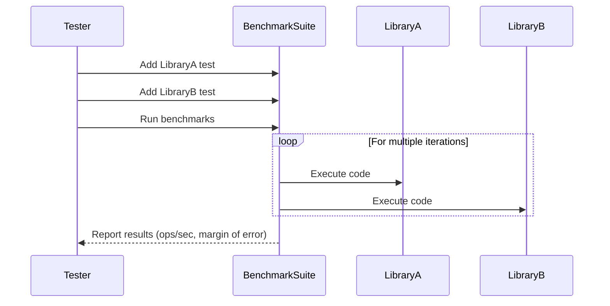

# Chapter 5: Benchmarks

In the previous chapter, [`toVal` function (internal)](04__toval__function__internal__.md), we explored how the `toVal` function helps `clsx` handle different types of inputs. Now, let's talk about speed! How fast is `clsx` compared to other similar libraries? That's what benchmarks are all about.

Imagine you're buying a car. You care about its features, but you also care about how fast it can go. Benchmarks are like a speed test for code libraries. They measure how long it takes for a library to perform a specific task. In the case of `clsx`, we're interested in how quickly it can generate class name strings.

## The Problem: Knowing if `clsx` is Fast Enough

When choosing a library, especially one that manipulates the DOM (like `clsx` does by affecting class names), performance matters. We want to make sure that using `clsx` isn't slowing down our website or application. We need a way to compare `clsx` to other libraries to see which one is the fastest.

## The `clsx` Solution: Benchmarks

The `clsx` project includes benchmarks that compare its performance against other popular class name manipulation libraries like `classnames` and `classcat`. These benchmarks run various scenarios, like concatenating strings, handling objects, and dealing with arrays, to give us a comprehensive view of `clsx`'s performance.

## Key Concepts

Let's break down what benchmarks are and how they work:

1.  **Scenario:** A specific task that we want to measure the performance of. For example, concatenating a list of strings, or conditionally adding class names based on an object.

2.  **Operations per Second (ops/sec):**  The number of times a library can complete a scenario in one second. This is the main metric we use to compare performance. Higher `ops/sec` means faster performance.

3.  **Margin of Error (%):**  Benchmarks aren't perfect. The margin of error tells us how much the results might vary each time we run the benchmark. A smaller margin of error means the results are more consistent.

4.  **Libraries Compared:** `clsx`'s benchmarks compare it against other libraries that do similar things. This helps us understand how `clsx` stacks up against the competition. In `clsx`'s case, it's compared with `classnames`, `classcat` and its own lite version.

## Usage Example: Running the Benchmarks

You typically don't run the benchmarks directly in your project. They're part of the `clsx` library's development process. However, if you're curious, you can clone the `clsx` repository from GitHub and run the benchmarks yourself.

Here's a simplified version of how the benchmarks are run (from `bench/index.js`):

```javascript
const { Suite } = require('benchmark');
const clsx = require('../dist/clsx');
const lite = require('../dist/lite');
const classnames = require('classnames');

function bench(name, ...args) {
	console.log(`\n# ${name}`);
	new Suite()
		.add('classnames  ', () => classnames.apply(classnames, args))
		.add('clsx        ', () => clsx.apply(clsx, args))
		.add('clsx (lite) ', () => lite.apply(lite, args))
		.on('cycle', e => console.log('  ' + e.target))
		.run();
}

bench(
	'Strings',
	'foo', '', 'bar', 'baz', 'bax', 'bux'
);
```

Here's what this code does:

1.  **Imports Libraries:** It imports the `benchmark` library and the `clsx` and `clsx/lite` functions. It also imports `classnames` for comparison.
2.  **`bench` Function:** This function defines a benchmark scenario. It takes a name (e.g., "Strings") and arguments (e.g., `'foo', '', 'bar'`).
3.  **`Suite` Object:** This creates a new benchmark suite using the `benchmark` library.
4.  **.add():** This adds different functions to the benchmark suite. Each `.add` call represents a different library being tested. The first argument is a label for the library (e.g., `'classnames'`), and the second argument is a function that calls the library with the given arguments.
5.  **.on('cycle'):** This is an event handler that gets called after each "cycle" of the benchmark. It logs the results to the console.
6.  **.run():** This starts the benchmark.

## Analyzing the Benchmark Results

The benchmark results (see `bench/readme.md`) typically look something like this:

```
# Strings
  classnames   x 6,540,072 ops/sec ±0.11% (101 runs sampled)
  clsx         x 12,924,662 ops/sec ±0.15% (102 runs sampled)
  clsx/lite    x 13,122,004 ops/sec ±0.40% (99 runs sampled)
```

This tells us that, for the "Strings" scenario:

*   `classnames` can perform about 6.5 million operations per second.
*   `clsx` can perform about 12.9 million operations per second.
*   `clsx/lite` can perform about 13.1 million operations per second.

In this scenario, `clsx` and `clsx/lite` are significantly faster than `classnames`.

## Under the Hood

The benchmarks use the `benchmark` library to measure the execution time of different code snippets. The `benchmark` library runs each code snippet multiple times and calculates the average execution time, margin of error, and other statistics.

Here's a simplified sequence diagram of how a benchmark works:



The `bench/index.js` file defines different scenarios and compares the performance of `clsx`, `clsx/lite`, and other libraries for each scenario. The results are then printed to the console.

## Why are Benchmarks Important?

Benchmarks help ensure that `clsx` remains a fast and efficient library. By regularly running benchmarks, the `clsx` developers can:

*   Identify performance bottlenecks.
*   Compare different implementation strategies.
*   Track performance improvements over time.
*   Make informed decisions about code changes.

## Conclusion

Benchmarks are essential for understanding the performance characteristics of `clsx`. They provide valuable data that helps ensure that `clsx` remains a fast and efficient library for building class name strings. While you likely won't run the benchmarks yourself, understanding what they are and how to interpret the results can help you make informed decisions about which libraries to use in your projects.

With this chapter, you've completed the `clsx` tutorial! You should now have a solid understanding of how to use `clsx` and its different features to dynamically build class name strings in your JavaScript projects. There isn't another chapter, so congrats!


---

Generated by [AI Codebase Knowledge Builder](https://github.com/The-Pocket/Tutorial-Codebase-Knowledge)